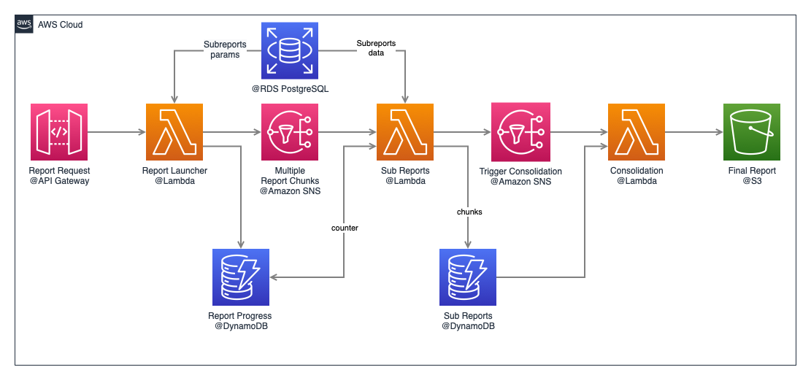

# serverless-reports-fan

## Initial problem
Over a year ago, we embarked on optimizing reports generation in our platform, with one of the goals being to improve overall speed, i.e. results delivered in less time.

The traditional programming approach we started with was a [ThreadPoolExecutor](https://docs.oracle.com/javase/8/docs/api/java/util/concurrent/ThreadPoolExecutor.html) which worked, but if concurrent reports were to be processed, the pool quickly got exhausted. So, what about thinking bigger and going all the way to Serverless? As AWS is our platform of choice, for over four years already, we have engineered a repeatable setup using [SNS](https://aws.amazon.com/sns/), [Lambda](https://aws.amazon.com/lambda/), [S3](https://aws.amazon.com/s3/), [API Gateway](https://aws.amazon.com/api-gateway/) and [DynamoDB](https://aws.amazon.com/dynamodb) that delivers a blazing fast performance which is not bound by server constraints but, by [AWS Service Limits](https://docs.aws.amazon.com/general/latest/gr/aws_service_limits.html) (which you can ask for upgrades at no cost).

## Current solution
Unsurprisingly, the solution taken is not too complex but certainly functional. I'll try to describe it on a step-by-step basis:

1. Request to generate a report arrives via API Gateway, with proper parameters/criteria for report generation, which in our case usually involve:
   * Report type / id
   * Date range
   * List of assets/items to include in the report
 2. A Lambda function (f1) retrieves parameters and creates a unique ID for each report.  
 3. Report generation is split based on the above list to partially gather the data for each asset/item separately by sending an SNS with the specific parameters for each "sub-report".
 4. A separate Lambda (f2) is triggered on a per SNS message to process each item's data, and each chunk is written to a 
 row on temporary storage (TTL set to a few hours) in a DynamoDB table.
 5. Every successful execution of Lambda f2 atomically decrements a pending task counter, and when the counter reaches zero, a final Lambda (f3) is invoked
 6. Function f3 gathers all chunks written to DynamoDB, consolidates them in the desired output format and writes them into an S3 bucket using the report ID as part of the object key.

## Motivation for sharing

The main goal of sharing this implementation with the Open Source Community is to turn this reference architecture into a repeatable and reusable solution for whoever needs it; we've been copying and adapting the code base on per use case but haven't yet structured it as a common shareable component.

The possible goal list might include:
* Packing essential pieces of Java code as Lambda Layers
* Writing a CloudFormation template for ease of deployment
* Templating for report output
* Websockets for report completion trigger

## Block diagram

